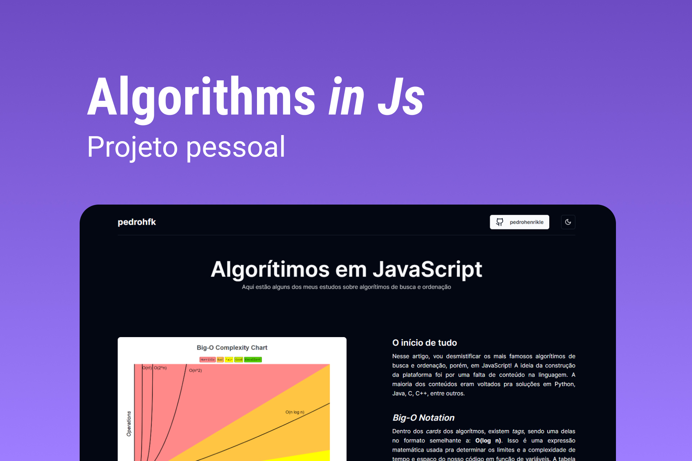

<h1 align="center" style="display: flex; align-items: center; width: 100%; justify-content: center; gap: 1rem;" >
    
Algoríthms <i>in JS</i>

</h1>

Este é um projeto pessoal que surgiu de uma necessidade. Buscando aprender sobre algorítmos de ordenação e busca, vi que normalmente são usadas outras linguagens de exemplo, como Python, C, C++ e Java. A partir disso, nasceu a ideia de trazer um local de consulta e aprendizado no ambiente JavaScript. 

  <a href="#-tecnologias">Tecnologias</a>&nbsp;&nbsp;&nbsp;|&nbsp;&nbsp;&nbsp;
  <a href="#-projeto">Projeto</a>&nbsp;&nbsp;&nbsp;|&nbsp;&nbsp;&nbsp;
  <a href="#-layout">Layout</a>&nbsp;&nbsp;&nbsp;|&nbsp;&nbsp;&nbsp;
  <a href="#memo-licença">Licença</a>

  

 

  

## 🚀 Tecnologias

Esse projeto foi desenvolvido com as seguintes tecnologias:

- HTML, CSS e JavaScript
- Git e Github
- Biblotecas:
    - [Vite](https://nextjs.org/)
    - [shadcn/ui](https://lucide.dev/)
    - [react.js](https://pt-br.reactjs.org/)
    - [node.js](https://www.react-fast-marquee.com/)
    - [tailwindcss](https://tailwindcss.com/)
    - [typescript](https://www.typescriptlang.org/)

## 💻 Como usar?

Caso queira utilizar os algorítmos para teste, baixe o projeto e execute: 
<code>npm install</code> ou <code>pnpm install</code>
 
 
Após isso entre em ***algorithms***, entre no algorítmo desejado e execute:
 
<code>npx tsc [nome_do_algoritmo].ts</code>
 e logo após um  
<code>node [nome_do_algoritmo].js</code>

- [Visite o projeto online](https://algorithms-in-js.vercel.app/)

## :memo: Licença

Esse projeto está sob a licença MIT.

---

## ✍ Author
 

    Made with 💜 by Pedro Henrique Klein

    
    

